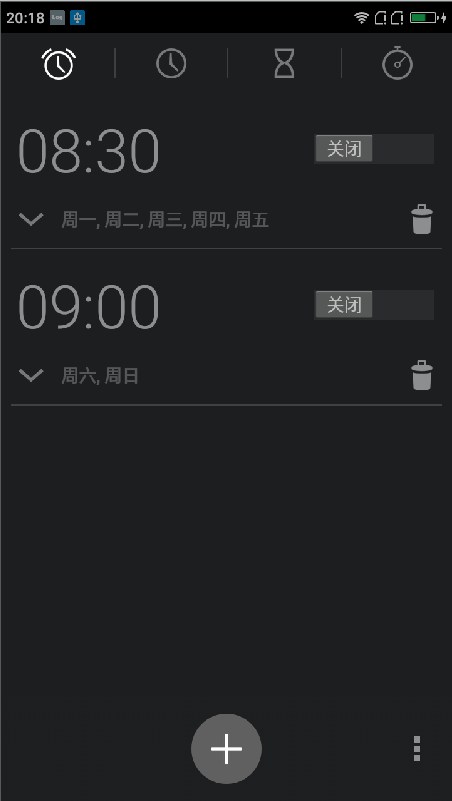
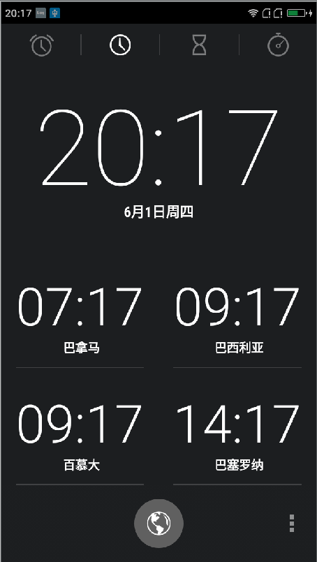
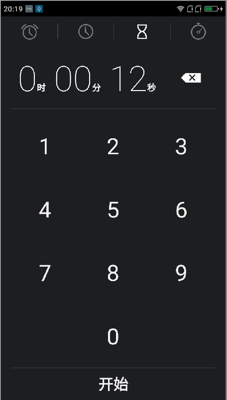
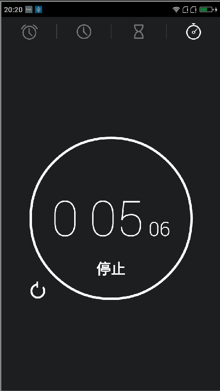

# Android 4.4 桌面时钟源代码

本桌面时钟是从Android4.4代码中直接抽离出来的，主要为了提供给大家一个学习系统项目机会，本应用有
四个模块，分别为：闹铃，各国时间，倒计时统计，时间计时计数统计，如果大家需要开发一个时钟或者是其
他的什么Ui界面的话，可以借鉴本源代码的，甚至都可以在此代码上进行二次开发避免进行无谓的重复的造轮
子了，从而节省更多的时间去做好的用户体验，同时如果时间充足的话也可以仔细看看别人的代码架构以及代码
规范，毕竟是google开发人员的。

本项目尽最大的努力保护源代码，只是我在整合编译的时候有些问题我做了修改，比如说一些加载内部资源或者
是调用hide方法和字段方便，我就使用了反射或者是直接拷贝了源代码过来，但是没有修改其逻辑，最大的还原
了当初的代码风貌。为了方便更好的安装应用，我将编译好的apk放在项目里面了(deskclock.apk)，下面我们
看看其最后的效果：

